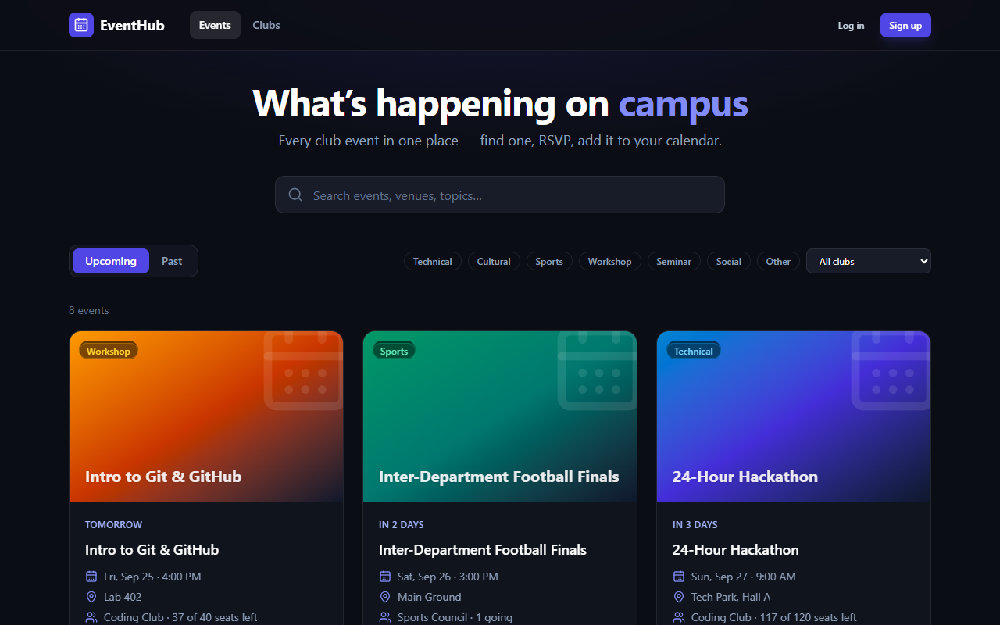
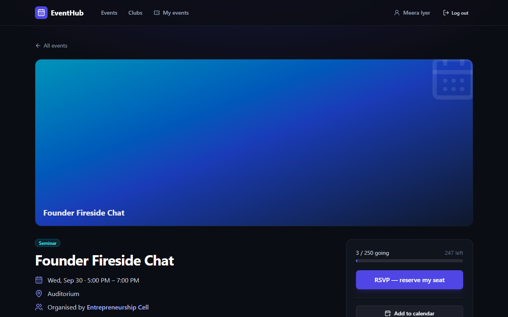
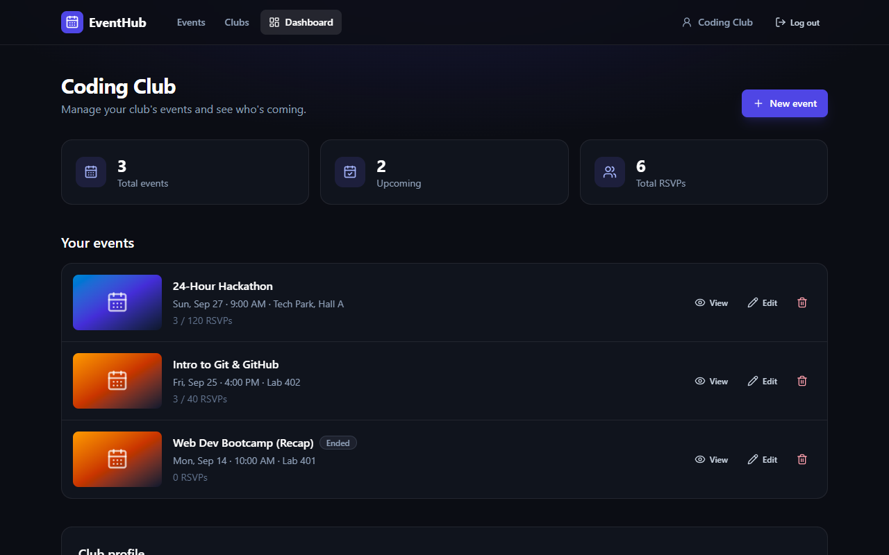
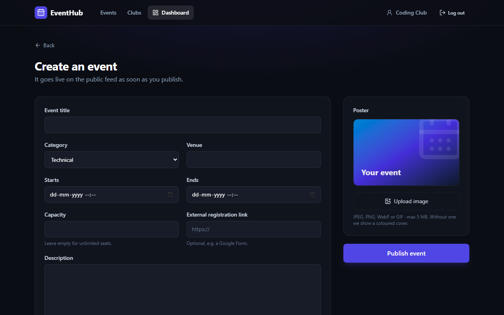
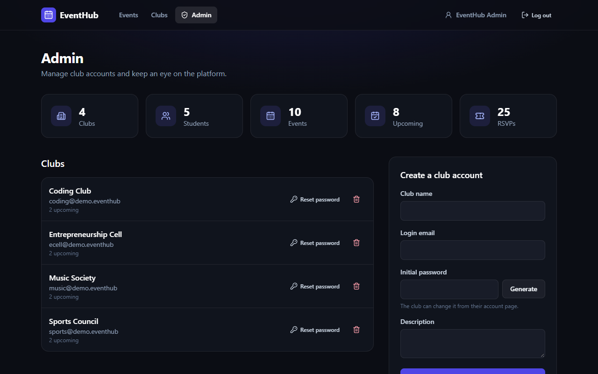

# EventHub — Campus Event Platform

[](https://github.com/aggamsingh/Club_and_Events/actions/workflows/ci.yml)

A full-stack web app where **student clubs publish events** and **students discover, RSVP to and keep track of them**. An **admin** manages club accounts and moderates content.

Built with **React 19 · React Router 7 · TanStack Query · Tailwind CSS 4** on the front end and **Node.js · Express 5 · MongoDB (Mongoose 9) · GridFS** on the back end. It has cookie-based JWT auth, role-based access control, over-booking-safe RSVPs and 60 automated tests, and ships as one Docker image.



| Event page (student) | Club dashboard |
| --- | --- |
|  |  |
| **Create / edit event** | **Admin console** |
|  |  |

---

## Features

**Everyone (no login)**
- Browse upcoming or past events: live search, category and club filters, pagination. Filters live in the URL, so results can be shared.
- Event pages show the poster, date range, venue, organiser, a seat-availability bar and **Add to calendar** (`.ics`).
- Club directory, and a page per club listing its events.

**Students**
- Self-sign-up and log in.
- **RSVP / cancel**, with capacity limits enforced atomically on the server.
- **My events**: upcoming and past RSVPs.

**Clubs**
- Dashboard with stats (total events, upcoming, total RSVPs).
- Create, edit and delete events, with an optional poster (JPEG/PNG/WebP/GIF, ≤ 5 MB, checked by magic bytes).
- Attendee list plus **CSV export** that is safe from spreadsheet formula injection.
- Edit the club's profile description.

**Admins**
- Platform stats.
- Create club accounts (with a password generator), reset club passwords (which revokes their sessions), and delete clubs (cascading to events, RSVPs and posters).
- Moderate (edit or delete) any event.

**Every account:** change password (logs out all other devices).

---

## Tech stack

| Layer | Technology |
| --- | --- |
| Front end | React 19, React Router 7, TanStack Query 5, Tailwind CSS 4, lucide-react, Vite 8 |
| Back end | Node.js (≥ 20.19), Express 5, Mongoose 9, Zod 4, Multer 2 |
| Database / files | MongoDB (Atlas or local); poster images in **GridFS** |
| Auth & security | JWT in an httpOnly SameSite cookie, bcrypt (cost 12), helmet (CSP/HSTS), express-rate-limit |
| Testing | `node:test` + Supertest + mongodb-memory-server (API); Vitest + Testing Library (UI) |
| Tooling | ESLint 10, GitHub Actions CI, multi-stage Dockerfile, Docker Compose |

Every choice and its tradeoffs is explained in [docs/TECH_STACK.md](docs/TECH_STACK.md) and [docs/DECISIONS.md](docs/DECISIONS.md).

---

## Quick start

### Option A — Docker (the whole stack in one command)

```bash
export JWT_SECRET=$(openssl rand -base64 48)
docker compose up --build -d
docker compose exec app npm run seed:demo --prefix server   # admin + demo data
```
Open <http://localhost:5000>.

### Option B — Local development (hot reload)

Prerequisites: Node.js ≥ 20.19 and a MongoDB (local `mongod`, Docker `docker run -p 27017:27017 mongo:7`, or a free Atlas cluster).

```bash
npm install                  # root tooling (concurrently)
npm run install:all          # server + client dependencies
cp server/.env.example server/.env   # then set MONGO_URI and JWT_SECRET
npm run seed:demo            # creates the admin from ADMIN_EMAIL/ADMIN_PASSWORD + demo data
npm run dev                  # API on :5000, React on http://localhost:5173
```

The Vite dev server proxies `/api` to Express, so the browser only ever talks to one origin, the same as in production.

### Demo accounts (after `seed:demo`)

| Role | Email | Password |
| --- | --- | --- |
| Admin | value of `ADMIN_EMAIL` | value of `ADMIN_PASSWORD` |
| Club | `coding@demo.eventhub` (also `music@`, `sports@`, `ecell@`) | `demo-password` |
| Student | `student1@demo.eventhub` … `student5@demo.eventhub` | `demo-password` |

---

## Scripts

| Where | Command | What it does |
| --- | --- | --- |
| root | `npm run dev` | API (watch mode) + Vite dev server together |
| root | `npm test` | All server and client tests |
| root | `npm run build` | Production build of the client into `client/dist` |
| root | `npm start` | Start the API; it also serves `client/dist` if present |
| server | `npm run seed` / `seed:demo` | Create or refresh the admin (+ demo data) |
| server | `npm run migrate:v1 [-- --dry-run]` | Migrate data from the original v1 schema |
| client | `npm run lint` | ESLint (React Hooks + Fast Refresh rules) |

---

## Project structure

```
events-website/
├── client/                    React SPA (Vite)
│   └── src/
│       ├── main.jsx           Router, QueryClient, providers, code-split routes
│       ├── components/        Layout, EventCard, Poster, ConfirmDialog, RequireRole, ui kit
│       ├── hooks/             useAuth (session), useToast
│       ├── lib/               api client, formatting, validation, constants
│       └── pages/             Events, EventDetail, Clubs, Club, Auth, Dashboard, EventForm, MyEvents, Admin, Account
├── server/                    Express API
│   ├── src/
│   │   ├── app.js             App factory: security middleware, routers, SPA hosting
│   │   ├── server.js          Entry point: DB connect, listen, graceful shutdown
│   │   ├── config.js          Zod-validated environment
│   │   ├── models/            User, Event, Rsvp (Mongoose)
│   │   ├── routes/            auth, events, clubs, me, admin, posters
│   │   ├── middleware/        auth (JWT, roles, ownership), validate (zod), errorHandler
│   │   ├── services/          posterStorage (Multer + GridFS + magic-byte sniffing)
│   │   └── utils/             schemas, serializers, ics, csv/text helpers, HttpError
│   ├── scripts/               seed.js, migrate-v1.js
│   └── tests/                 API integration tests (in-memory MongoDB)
├── docs/                      Requirements, architecture, API, decisions, security, deployment…
├── Dockerfile · docker-compose.yml · .github/workflows/ci.yml
```

---

## Documentation

| Document | Contents |
| --- | --- |
| [docs/REQUIREMENTS.md](docs/REQUIREMENTS.md) | Functional requirements by role, non-functional requirements, out of scope |
| [docs/ARCHITECTURE.md](docs/ARCHITECTURE.md) | System diagram, request lifecycle, data model, auth and RSVP flows |
| [docs/API.md](docs/API.md) | Every endpoint: auth, parameters, responses, errors |
| [docs/DECISIONS.md](docs/DECISIONS.md) | Architecture decision records: what was chosen, alternatives, tradeoffs |
| [docs/TECH_STACK.md](docs/TECH_STACK.md) | Every library and tool, what it does here and why |
| [docs/SECURITY.md](docs/SECURITY.md) | Threat model, controls, v1 audit findings and fixes, secret rotation |
| [docs/TESTING.md](docs/TESTING.md) | Test strategy and what each suite covers |
| [docs/DEPLOYMENT.md](docs/DEPLOYMENT.md) | Render/Railway + Atlas, Docker, split-origin hosting, checklists |
| [CHANGELOG.md](CHANGELOG.md) | v1 → v2 changes |

## License

MIT
