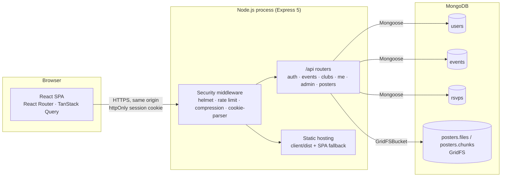
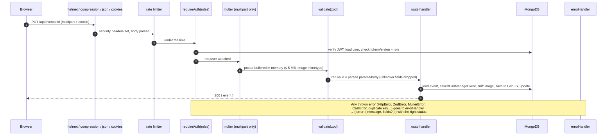
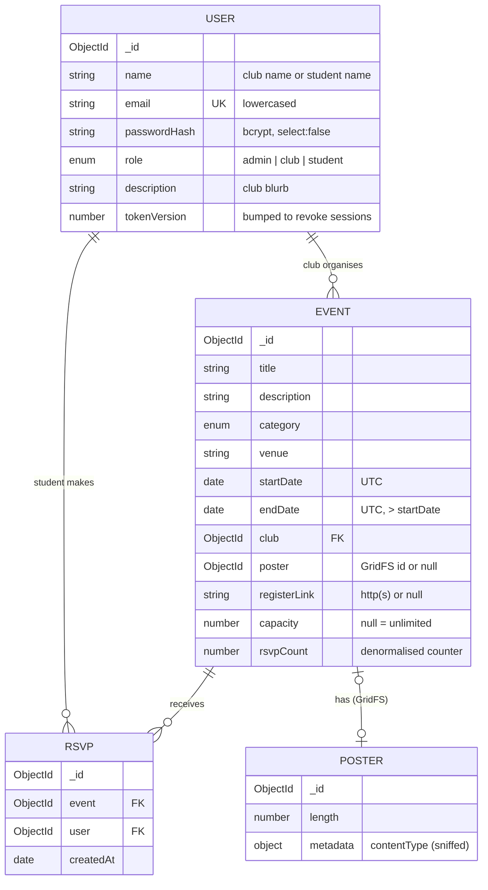
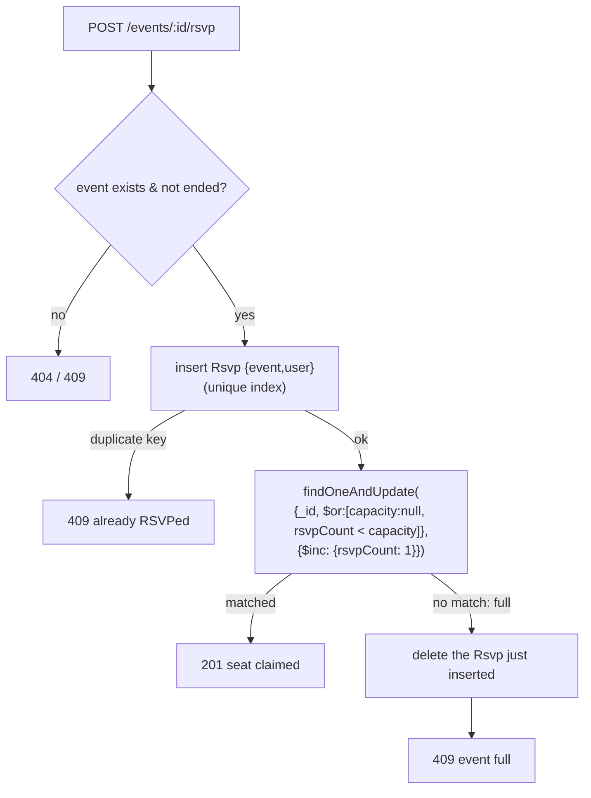
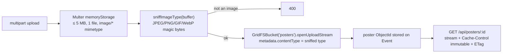
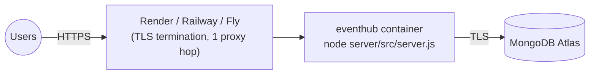

# Architecture

## 1. System overview

EventHub is a **single-page React app** backed by a **stateless Express REST API** and **MongoDB**. In production, one Node process serves both the API (`/api/*`) and the built React files, so the browser only ever talks to **one origin**.



**Development:** Vite serves the React app on `:5173` with hot reload and **proxies `/api` to Express on `:5000`**. The same-origin model, and therefore the cookie and CSRF behaviour, is identical in dev and prod.

## 2. Back end

### 2.1 Layering

```
server/src
├── server.js          process entry: validate config → connect DB → listen → graceful shutdown
├── app.js             createApp(): middleware stack, routers, static hosting, error handler
├── config.js          Zod-validated env → typed config object
├── db.js              connect / disconnect / readiness; builds indexes on boot
├── models/            Mongoose schemas + indexes (User, Event, Rsvp)
├── routes/            HTTP handlers grouped by resource
├── middleware/        auth (session → req.user, role & ownership guards), validate (zod), errorHandler
├── services/          posterStorage: Multer config, magic-byte sniffing, GridFS I/O
└── utils/             zod schemas, serializers, ICS writer, CSV/regex/slug helpers, HttpError
```

`createApp()` is separate from `server.js` so tests can build the app and drive it with Supertest without opening a port.

Route handlers stay thin enough that a separate controller layer would add indirection without value at this size (see ADR-010). Anything reused or security-sensitive lives in middleware, services or utils.

### 2.2 Request lifecycle



Express 5 forwards rejected promises from async handlers to the error handler automatically, so there are no `try/catch` blocks just for forwarding errors.

### 2.3 Error contract

Every error response has the same shape, which the client's `api()` wrapper turns into an `ApiError`:

```json
{ "error": { "message": "Please fix the highlighted fields.", "fields": { "endDate": "End time must be after the start time." } } }
```

| Source | Status |
| --- | --- |
| `HttpError` thrown by code | as thrown (400/401/403/404/409) |
| Zod validation failure | 400 + `fields` |
| Mongoose validation / cast error | 400 |
| Duplicate key (`E11000`) | 409 + `fields` |
| Multer file too large | 413 |
| Malformed JSON | 400 |
| Unknown `/api` route | 404 |
| Anything else | 500 with a generic message (details logged server-side only) |

## 3. Data model



### Indexes and why they exist

| Collection | Index | Serves |
| --- | --- | --- |
| users | `{ email: 1 }` unique | login lookup, duplicate prevention |
| users | `{ name: 1 }` unique, partial `role: 'club'`, collation strength 2 | case-insensitive unique club names (students may share names) |
| events | `{ endDate: 1, startDate: 1 }` | upcoming/past filter + sort on the feed |
| events | `{ club: 1, startDate: -1 }` | club pages, club dashboard, cascade delete |
| events | `{ category: 1, endDate: 1 }` | category-filtered feed |
| rsvps | `{ event: 1, user: 1 }` unique | "one RSVP per student per event", attendee lists |
| rsvps | `{ user: 1, createdAt: -1 }` | "My events" |

Indexes are built on boot (`Model.init()`), so uniqueness is enforced before the first request.

### Why a single `users` collection

Clubs, students and admins all log in the same way. One collection means one login path and one session mechanism. Role differences are a single `role` field checked by middleware. Club-only data (`description`) is a small optional field. See ADR-004.

## 4. Authentication & authorisation

```mermaid
sequenceDiagram
    participant B as Browser
    participant S as API
    participant DB as MongoDB
    B->>S: POST /api/auth/login {email, password}
    S->>DB: find user by email (+passwordHash)
    S->>S: bcrypt.compare (dummy hash if no user → constant time)
    S-->>B: 200 {user} + Set-Cookie eh_session=JWT{sub, role, ver}<br/>HttpOnly; Secure; SameSite=Lax; 7d
    B->>S: any request (cookie sent automatically)
    S->>S: jwt.verify(signature, expiry)
    S->>DB: findById(sub), compare tokenVersion
    S-->>B: 401 if invalid/revoked · 403 if wrong role/not owner
```

- **Authentication:** a JWT signed with `JWT_SECRET` in an **httpOnly** cookie. The SPA can't read it, and learns who is logged in by calling `GET /api/auth/me`, which TanStack Query caches under `['me']`.
- **Revocation:** each user has `tokenVersion`. Password change and admin reset increment it, which invalidates every outstanding token. The current device gets a fresh cookie.
- **Authorisation:** three layers.
  1. `requireAuth()`: logged in.
  2. `requireAuth('club', 'admin')`: role check.
  3. `assertCanManageEvent(user, event)`: ownership (club must own the event, or be admin).
- **UI guards** (`<RequireRole>`) only improve UX. The API enforces every rule on its own.

## 5. RSVP concurrency

The hard requirement is *never over-book* (FR-R2). A naive "read count → compare → write" lets two requests both see "1 seat left". The implementation uses two atomic single-document operations plus a compensating action:



MongoDB applies each single-document update atomically, so the conditional `$inc` can succeed at most `capacity` times. The test suite fires 10 simultaneous RSVPs at a 3-seat event and asserts exactly 3 × 201 and 7 × 409. See ADR-006 for why this beats a multi-document transaction here.

## 6. File storage (posters)



- The poster is checked **before** anything is written. On any later failure the freshly saved file is deleted, so there are no orphaned files.
- Replacing a poster creates a **new id**, so poster URLs never change content and can be cached forever.
- The old file is deleted only after the event update has been saved.

## 7. Front end

```
client/src
├── main.jsx          QueryClient (global 401 → logged-out), router, lazy routes
├── hooks/useAuth     session state from /api/auth/me; login/register/logout
├── hooks/useToast    tiny toast system (aria-live)
├── lib/api.js        fetch wrapper: cookies, JSON/FormData, ApiError
├── lib/format.js     Intl-based dates, datetime-local ↔ UTC ISO
├── lib/validation.js client mirror of the server's event rules
├── components/       Layout/Navbar, EventCard(+skeleton), Poster, Pagination, ConfirmDialog (<dialog>), RequireRole, ui kit
└── pages/            one file per route
```

- **Server state** (events, clubs, the current user) lives in **TanStack Query**: caching, request deduplication, background refetch, `keepPreviousData` for smooth pagination, targeted invalidation after mutations.
- **URL state** (search, filters, page) lives in `useSearchParams`.
- **Local UI state** (form fields, dialogs) is plain `useState`. There is no global store, because nothing needs one (ADR-009).
- **Code splitting:** Dashboard, EventForm, Admin, MyEvents and Account are `React.lazy` chunks.
- **Forms** show server field errors (`error.fields`) next to the matching input. Client-side validation mirrors the server rules for instant feedback.

### Routes

| Path | Page | Access |
| --- | --- | --- |
| `/` | Event feed (search/filter/paginate) | public |
| `/events/:id` | Event detail, RSVP, calendar, attendees (owner) | public |
| `/clubs`, `/clubs/:id` | Club directory, club page | public |
| `/login`, `/register` | Auth | public |
| `/my-events` | RSVPs | student |
| `/dashboard` | Club dashboard + profile | club |
| `/dashboard/events/new` | Create event | club |
| `/dashboard/events/:id/edit` | Edit event | owner club, admin |
| `/admin` | Stats, club management | admin |
| `/account` | Profile, change password | any logged-in |

## 8. Deployment topology

The default is **one container** (API + static client) plus **MongoDB Atlas**:



Split hosting (static front end on Vercel/Netlify, API elsewhere) is supported through `CLIENT_ORIGIN` + `VITE_API_URL`, at the cost of cross-site cookies. See [DEPLOYMENT.md](DEPLOYMENT.md) and ADR-003.
